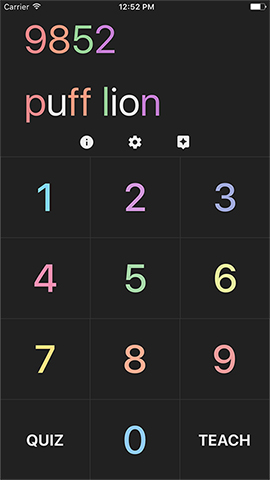

# NumberThink
NumberThink is an iOS app for learning the Major System, a well-known technique for remembering numbers by associating them with words. It's a universal app written in Swift using adaptive layout and is available as a free download in the [App Store](https://itunes.apple.com/no/app/numberthink/id320948236?mt=8).

